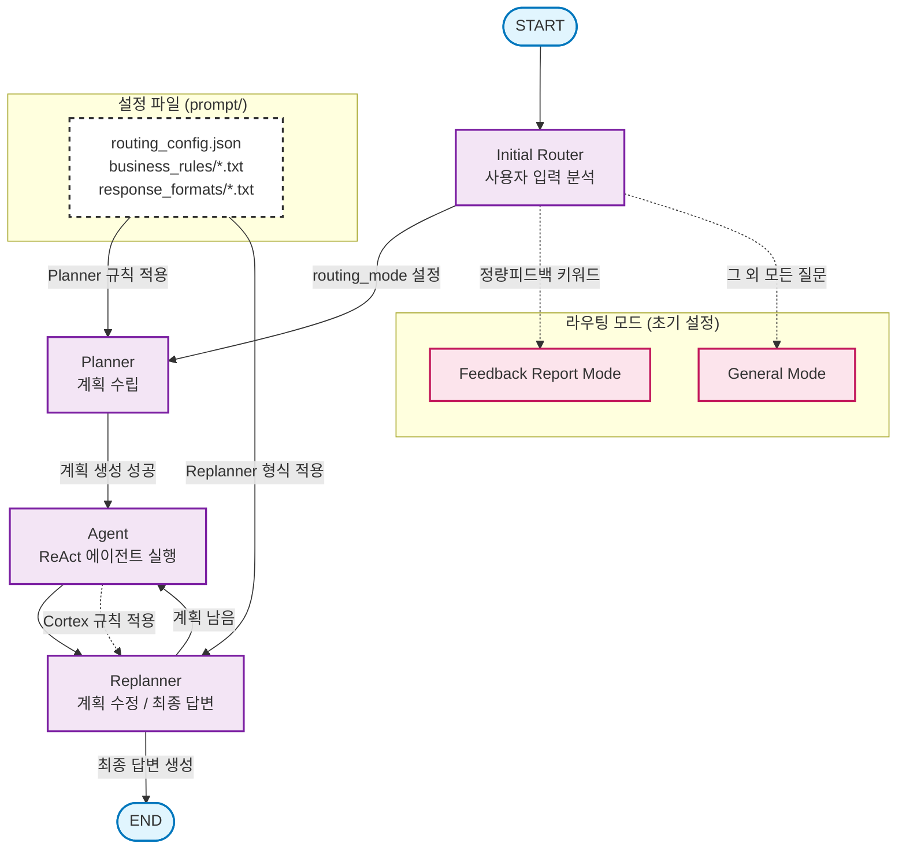

# MCP Agents Chainlit MVP Prototype

이 프로젝트는 LangGraph와 Chainlit을 기반으로 구축된, 동적 설정에 따라 동작하는 Plan-and-Execute 모델의 스마트 에이전트입니다.

에이전트의 모든 핵심 동작(계획, 응답 생성, 규칙 적용)은 파이썬 코드를 직접 수정하는 대신, `prompt` 폴더 내의 설정 파일 (`.json`, `.txt`)을 통해 제어됩니다.

## ARCHITECTURE

### 핵심 아키텍처
이 에이전트는 두 가지 주요 요청 유형을 처리하도록 설계되었습니다.
1.  **정량 피드백 보고서 요청**: 사용자가 "정량 피드백"을 요청하면, 정해진 비즈니스 규칙과 보고서 형식에 따라 일관된 결과물을 생성합니다.
2.  **일반 데이터 분석 및 질의응답**: 그 외 모든 일반적인 질문에 대해 유연하게 답변합니다. 특히 데이터 조회 도구(`fashion_analyst` 등)가 사용되었을 경우, 데이터 분석에 특화된 규칙을 동적으로 적용 가능합니다.
  

 
### 워크플로우 주요 구성 요소
 
- **Initial Router**: 사용자 입력 분석 및 라우팅 모드 설정 (`"정량"` 키워드 감지)
- **Planner**: 라우팅 모드별 동적 프롬프트를 적용한 5단계 실행 계획 수립
- **Agent**: LangChain 도구를 활용한 ReAct 에이전트로 계획 단계 실행
- **Replanner**: 계획 수정 또는 라우팅 모드별 특화된 최종 답변 생성
 
### 라우팅 모드
 
- **General Mode**: 일반적인 질문 처리
- **Feedback Report Mode**: 비즈니스 정량 피드백 보고서 생성 (정규화된 지표 형식 적용)
- **Cortex Mode**: Snowflake/Cortex 환경 특화 처리 (데이터 조회 기준 자동 인식)
 
## 프로젝트 구조

```
mcp-agents-chainlit/
├── app_chainlit.py             #  cadeiapp 메인 실행 파일
├── utils/
│   └── llm_setup.py            # LangGraph 에이전트 생성 및 핵심 로직
└── prompt/
    ├── routing_config.json     # ⭐️ 에이전트 행동 제어 설정 파일
    ├── business_rules/
    │   ├── feedback_report.txt # 정량 피드백 요청 시 Planner가 참고할 규칙
    │   └── cortex.txt          # 데이터 분석 도구 사용 시 Replanner가 참고할 규칙
    ├── response_formats/
    │   ├── feedback_report.txt # 정량 피드백의 최종 응답 형식
    │   └── general.txt         # 일반 질문의 최종 응답 형식
    └── system_prompt_*.txt     # 에이전트의 기본 역할/페르소나 정의
```

## HOW_IT_WORKS

에이전트는 사용자의 질문을 다음과 같은 단계로 처리합니다.

1.  **라우팅 (`initial_router`)**:
    -   사용자 질문에 "정량피드백" (공백 무시) 키워드가 있는지 확인합니다.
    -   키워드가 있으면 `routing_mode`를 `feedback_report`로, 없으면 `general`로 설정합니다.

2.  **계획 수립 (`plan_step`)**:
    -   `routing_config.json`에서 현재 `routing_mode`에 맞는 설정을 가져옵니다.
    -   **(feedback_report 모드)**: `planner_business_rules` 와 `response_format` 에 정의된 파일들을 모두 읽고, `planner_final_instruction` 의 지시에 따라 **보고서 형식에 맞는 지표만 조회**하도록 효율적인 계획을 세웁니다.
    -   **(general 모드)**: 특별한 규칙 없이 일반적인 계획을 세웁니다.

3.  **계획 실행 (`execute_step`)**:
    -   수립된 계획에 따라 `fashion_analyst` 같은 데이터 조회 도구를 사용하여 필요한 정보를 수집합니다.

4.  **응답 생성 (`replan_step`)**:
    -   `routing_config.json`에서 현재 `routing_mode`에 맞는 `response_format`과 `replanner_user_prompt`를 가져옵니다.
    -   **(공통 로직)**: 만약 이전 단계에서 `fashion_analyst` 같은 **데이터 분석 도구가 사용되었다면**, `cortex.txt` 규칙을 동적으로 추가하여 데이터 기반의 깊이 있는 해석을 덧붙입니다.
    -   최종적으로, 결정된 형식과 내용에 따라 사용자에게 답변을 생성하여 전달합니다.

## HOW_TO_EXTEND
새로운 유형의 요청 적용 예시

"주간 인기 상품 보고서" 기능을 추가하려면 다음 단계만 따르면 됩니다.

1.  **규칙/형식 파일 생성**:
    -   `prompt/business_rules/weekly_popular.txt` (주간 보고서 계획 규칙) 생성.
    -   `prompt/response_formats/weekly_popular.txt` (주간 보고서 응답 형식) 생성.

2.  **설정 추가**:
    -   `prompt/routing_config.json` 파일에 `weekly_report` 라는 새로운 키를 추가하고, 위에서 만든 파일 경로와 새로운 지시사항들을 정의합니다.

    ```json
    "weekly_report": {
      "planner_business_rules": ["prompt/business_rules/weekly_popular.txt"],
      "response_format": "prompt/response_formats/weekly_popular.txt",
      "add_response_format_to_planner": true,
      "planner_final_instruction": "주간 인기 상품 보고서 형식에 맞춰 필요한 데이터를 조회하는 계획을 세워주세요.",
      "replanner_user_prompt": "수집된 데이터를 바탕으로 주간 인기 상품 보고서를 작성해주세요."
    }
    ```

3.  **라우터 수정**:
    -   `utils/llm_setup.py`의 `initial_router` 함수에 "주간 인기" 같은 새로운 키워드를 감지하여 `routing_mode`를 `weekly_report`로 설정하는 로직 한 줄을 추가합니다.


## 사용자 추가
-   새로운 사용자를 추가하려면 `add_user.py` 스크립트를 사용해야 합니다.
    ```bash
    python add_user.py --id [사용자 ID] --name "[사용자 이름]" --org "[소속]"
    ```
-   자세한 사용법은 `python add_user.py --help` 명령어로 확인할 수 있습니다.

## 참고

-   이 프로젝트는 계속해서 개선되고 있으며, 코드 구조나 기능이 변경될 수 있습니다.
-   최신 변경 사항은 `git log`와 코드 내 주석을 참고해주세요.
-   개선 제안이나 버그 발견 시 이슈를 등록해주시면 감사하겠습니다.