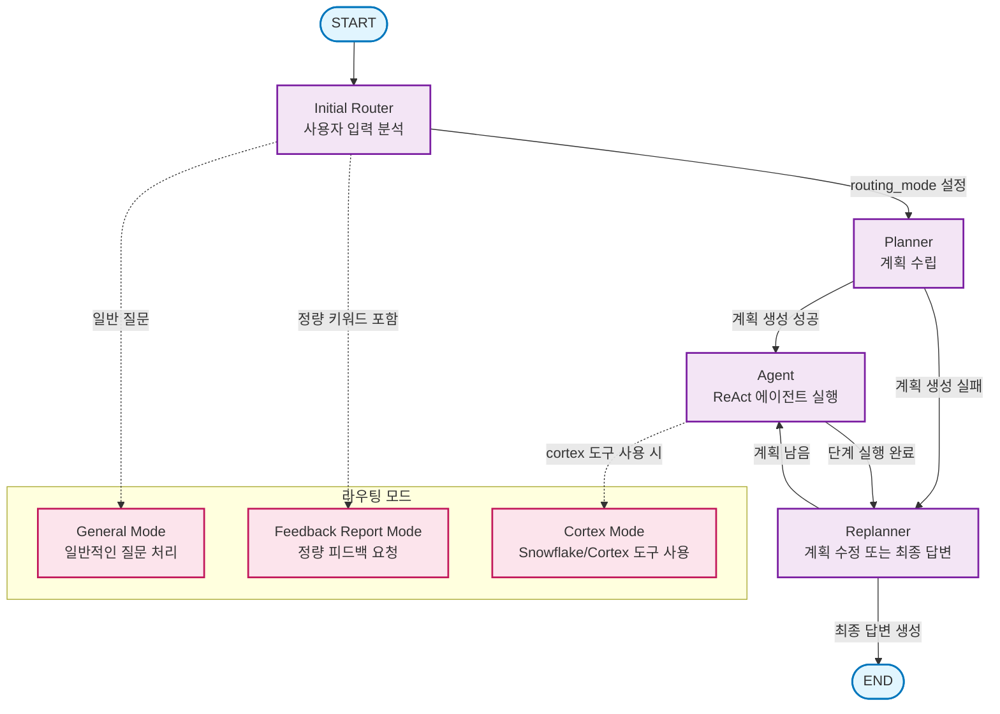

# MCP Agents Chainlit MVP Prototype

이 프로젝트는 MCP 플랫폼 기반의 Chainlit MVP 프로토타입입니다.

## 주요 특징

- Chainlit, LangChain, LangGraph 등 LLM 프레임워크 활용
- MCP 플랫폼 연동 (Snowflake Cortex)
- 사용자 정보 및 대화 기록 관리를 위한 SQLite DB 사용
- 모듈화된 코드 구조 (`utils` 디렉터리)

## LangGraph 워크플로우 구조

이 프로젝트는 사용자 입력에 따라 동적으로 라우팅되는 Plan-and-Execute 패턴을 구현한 LangGraph 워크플로우를 사용합니다.


```mermaid
flowchart TD
    START([START]) --> IR[Initial Router<br/>사용자 입력 분석]
    
    IR --> |routing_mode 설정| PLANNER[Planner<br/>계획 수립]
    
    PLANNER --> |계획 생성 성공| AGENT[Agent<br/>ReAct 에이전트 실행]
    PLANNER --> |계획 생성 실패| REPLAN[Replanner<br/>계획 수정 또는 최종 답변]
    
    AGENT --> |단계 실행 완료| REPLAN
    
    REPLAN --> |계획 남음| AGENT
    REPLAN --> |최종 답변 생성| END([END])
    
    %% 라우팅 모드별 처리
    subgraph "라우팅 모드"
        GENERAL[General Mode<br/>일반적인 질문 처리]
        FEEDBACK[Feedback Report Mode<br/>정량 피드백 요청]
        CORTEX[Cortex Mode<br/>Snowflake/Cortex 도구 사용]
    end
    
    %% 조건부 분기 설명
    IR -.-> |"정량" 키워드 포함| FEEDBACK
    IR -.-> |일반 질문| GENERAL
    AGENT -.-> |cortex 도구 사용 시| CORTEX
    
    %% 스타일링
    classDef startEnd fill:#e1f5fe,stroke:#0277bd,stroke-width:2px
    classDef process fill:#f3e5f5,stroke:#7b1fa2,stroke-width:2px
    classDef mode fill:#fce4ec,stroke:#c2185b,stroke-width:2px
    
    class START,END startEnd
    class IR,PLANNER,AGENT,REPLAN process
    class GENERAL,FEEDBACK,CORTEX mode
```

### 워크플로우 주요 구성 요소

- **Initial Router**: 사용자 입력 분석 및 라우팅 모드 설정 (`"정량"` 키워드 감지)
- **Planner**: 라우팅 모드별 동적 프롬프트를 적용한 5단계 실행 계획 수립
- **Agent**: LangChain 도구를 활용한 ReAct 에이전트로 계획 단계 실행
- **Replanner**: 계획 수정 또는 라우팅 모드별 특화된 최종 답변 생성

### 라우팅 모드

- **General Mode**: 일반적인 질문 처리
- **Feedback Report Mode**: 비즈니스 정량 피드백 보고서 생성 (정규화된 지표 형식 적용)
- **Cortex Mode**: Snowflake/Cortex 환경 특화 처리 (데이터 조회 기준 자동 인식)

## 프로젝트 구조

```
mcp-agents-chainlit/
├── .chainlit/
├── mcp_servers/
│   ├── cortex_agents.py
│   └── korea_weather.py
├── prompt/
│   ├── system_prompt_general.txt
│   └── system_prompt_got_deep.txt
├── public/
│   ├── custom.css
│   ├── custom.js
│   ├── logo_dark.png
│   └── logo_light.png
├── utils/
│   ├── db_utils.py
│   ├── llm_setup.py
│   ├── memory_manager.py
│   └── ui_utils.py
├── .dockerignore
├── .gitignore
├── add_user.py
├── app_chainlit.py
├── chainlit.md
├── chat_history.db
├── config.json
├── docker-compose.yaml
├── Dockerfile
├── environment.yaml
├── README.md
├── requirements.txt
└── simple_db_viewer.py
```

## 시스템 구성 요소 및 설명

*   **`app_chainlit.py`**: Chainlit 기반의 메인 애플리케이션 파일입니다. LangGraph ReAct Agent를 사용하여 사용자 입력을 처리합니다.
*   **`config.json`**: LLM 모델, 사용자 정보 등 주요 설정을 관리하는 파일입니다.
*   **`add_user.py`**: SQLite DB에 신규 사용자를 추가하는 스크립트입니다.
*   **`simple_db_viewer.py`**: SQLite DB의 내용을 간단하게 조회할 수 있는 스크립트입니다.
*   **`chat_history.db`**: 사용자 정보와 대화 기록을 저장하는 SQLite 데이터베이스 파일입니다.

*   **`prompt/`**: 시스템 프롬프트 파일을 저장하는 디렉터리입니다.
    *   `system_prompt_general.txt`: 일반적인 대화를 위한 시스템 프롬프트입니다.
    *   `system_prompt_got_deep.txt`: 심층적인 분석이나 작업 수행을 위한 시스템 프롬프트입니다.

*   **`utils/`**: 기능별로 모듈화된 유틸리티 스크립트를 관리하는 디렉터리입니다.
    *   `db_utils.py`: 데이터베이스 관련 유틸리티 함수를 포함합니다.
    *   `llm_setup.py`: LangChain 및 LangGraph 모델 설정을 담당합니다.
    *   `memory_manager.py`: 대화 기록 관리를 위한 메모리 관련 함수를 포함합니다.
    *   `ui_utils.py`: Chainlit UI 관련 유틸리티 함수를 포함합니다.

*   **`mcp_servers/`**: MCP Agent 서버 관련 스크립트를 포함합니다.
    *   `cortex_agents.py`: Snowflake Cortex 기반의 에이전트 코드입니다.
    *   `korea_weather.py`: (예시) 날씨 정보 제공 에이전트 코드입니다.

*   **`public/`**: Chainlit UI 커스터마이징을 위한 정적 파일(CSS, JS, 이미지)을 포함합니다.

*   **Docker 관련 파일**:
    *   `Dockerfile`: 애플리케이션 실행을 위한 Docker 이미지를 빌드합니다.
    *   `docker-compose.yaml`: Docker 컨테이너 실행을 위한 설정을 관리합니다.
    *   `.dockerignore`: Docker 이미지 빌드 시 제외할 파일 및 디렉터리를 지정합니다.

## 설치 방법

1.  저장소 클론
2.  **Python 3.11** 환경 준비
3.  필요한 패키지 설치
    ```bash
    pip install -r requirements.txt
    ```

## 실행 방법

1.  `config.json` 파일에 연동할 MCP서버 정보를 입력합니다.
2.  프로젝트 루트 디렉토리에서 아래 명령어를 실행하여 Chainlit 서버를 시작합니다.
    ```bash
    chainlit run app_chainlit.py --port 8000
    ```
3.  웹 브라우저에서 `http://localhost:8000` 주소로 접속합니다.

## 사용자 추가 방법

-   새로운 사용자를 추가하려면 `add_user.py` 스크립트를 사용해야 합니다.
    ```bash
    python add_user.py --id [사용자 ID] --name "[사용자 이름]" --org "[소속]"
    ```
-   자세한 사용법은 `python add_user.py --help` 명령어로 확인할 수 있습니다.

## 참고

-   이 프로젝트는 계속해서 개선되고 있으며, 코드 구조나 기능이 변경될 수 있습니다.
-   최신 변경 사항은 `git log`와 코드 내 주석을 참고해주세요.
-   개선 제안이나 버그 발견 시 이슈를 등록해주시면 감사하겠습니다.